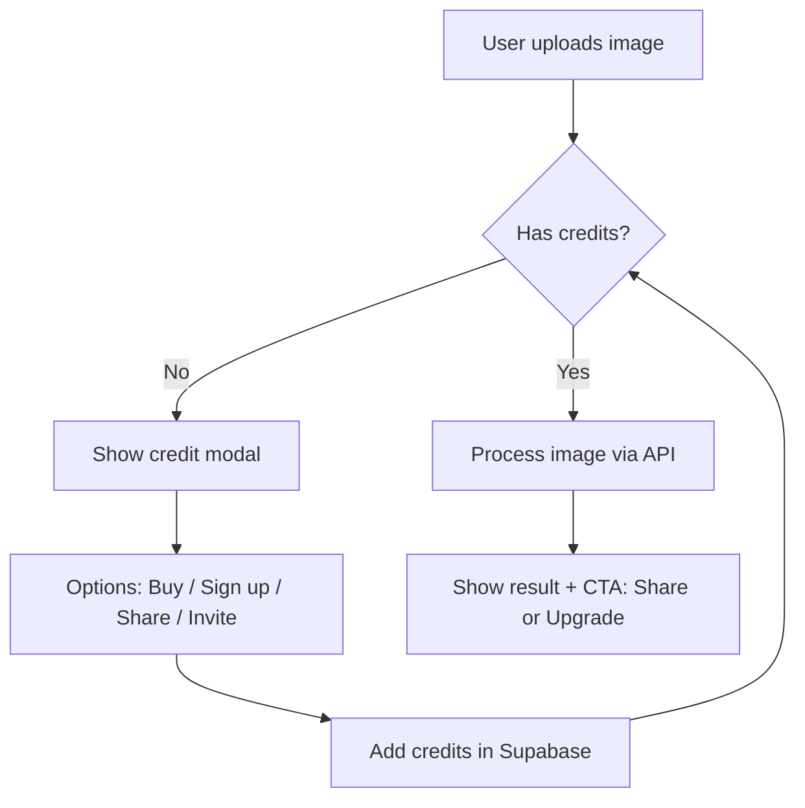

# 🧭 SimplyPNG — Lean Monetization Plan (No-Ads Model)

**Version:** 1.0
**Author:** Leen Labs / SimplyPNG
**Purpose:** Define sustainable monetization alternatives to rewarded ads, focusing on low-cost implementation, better UX, and fast iteration.

---

## 1. Background

Rewarded ad models (e.g., “watch a 30-second ad to earn credits”) are technically feasible on the web but introduce:

* **High integration cost** (Ad SDK setup, reward callbacks, anti-bot validation)
* **Low monetization yield** (<$0.05 per view)
* **UX disruption** (breaks user flow)
* **Regulatory overhead** (GDPR/PDPA/AdSense review)

Given SimplyPNG’s lean SaaS nature and small-to-mid user base at MVP stage, we will **defer ad-based monetization** and instead implement low-friction, growth-oriented alternatives.

---

## 2. Core Objectives

1. Keep the **user flow uninterrupted** by ads.
2. Introduce **lightweight, high-impact incentives** for sign-ups and sharing.
3. Build a **credit-based loop** that can easily integrate with Stripe or Supabase.
4. Optimize for **fast deployment on Windsurf + Next.js + Supabase stack**.

---

## 3. Lean Monetization Alternatives

### A. Free Tier + Paid Credit Packs

**Concept:** Offer limited daily edits for free. When exhausted, upsell credit packs.

| Feature            | Free User    | Paid User |
| ------------------ | ------------ | --------- |
| Daily edits        | 3 images/day | Unlimited |
| Background removal | ✅            | ✅         |
| Storage (Supabase) | ❌            | ✅         |
| Watermark          | ✅            | ❌         |

**Pricing (example):**

* $2.98 → 40 credits
* $6.98 → 100 credits
* $9.98 → 200 credits

**Implementation Notes (Windsurf):**

* Store credit count in Supabase (table: `user_credits`)
* On each API call → `credits - 1`
* When `credits == 0` → prompt purchase via Stripe modal
* Frontend component: `/components/CreditMeter.tsx`

---

### B. Email Registration Bonus

**Concept:** Convert anonymous users to registered users by giving bonus credits.

**Flow:**

1. Anonymous user performs 2 edits → show modal:
   *“Sign up to get +5 free credits!”*
2. On Supabase Auth signup success → increment `user_credits` by 5.

**Benefits:**

* Builds user retention base.
* Collects emails for remarketing / analytics.

**Implementation (Windsurf tips):**

* Use Supabase Auth (`auth.onAuthStateChange`)
* Create API route `/api/addBonusCredits`
* Guard against multiple claims with `claimed_bonus` boolean flag in `profiles` table.

---

### C. Social Share Bonus

**Concept:** Reward users who share SimplyPNG link on social media.

**Flow:**

1. User clicks “Share & Get +1 Credit”
2. Social share opens in new tab (Twitter, Facebook, etc.)
3. After share click → call API `/api/claimShareBonus`

**Implementation Notes:**

* Frontend detection can rely on button click + cooldown timer.
* Store timestamp of last share in Supabase to prevent farming:

  ```sql
  share_last_claim TIMESTAMP
  ```
* Optional: verify via shortened URL tracking (e.g., Bitly API).

**UX Note:**
Keep share bonus lightweight (1–2 credits max) to maintain fairness.

---

### D. Referral Bonus

**Concept:** Encourage user-driven acquisition through simple referral codes.

**Flow:**

1. User gets unique referral link: `https://simplypng.com?ref=abcd123`
2. If new signup occurs with this ref:

   * Referrer gets +5 credits
   * New user gets +2 credits

**Implementation Notes:**

* Store `ref_code` in `profiles` table.
* When new signup occurs with query param `?ref=`, match and update both users’ credit balances.
* Use Supabase trigger function for automatic updates:

  ```sql
  create function reward_referral() returns trigger as $$
  begin
    update user_credits set credits = credits + 5 where user_id = NEW.referrer_id;
    update user_credits set credits = credits + 2 where user_id = NEW.id;
    return NEW;
  end;
  $$ language plpgsql;
  ```

---

## 4. Product Flow Summary (UX/Logic Diagram)



---

## 5. Database Design (Supabase)

**Table: `user_credits`**

| Column             | Type      | Description                     |
| ------------------ | --------- | ------------------------------- |
| `user_id`          | uuid      | FK to `auth.users`              |
| `credits`          | int       | Remaining credits               |
| `updated_at`       | timestamp | Auto-update                     |
| `share_last_claim` | timestamp | To limit social bonus frequency |

**Table: `profiles`**

| Column          | Type    | Description                    |
| --------------- | ------- | ------------------------------ |
| `id`            | uuid    | PK                             |
| `claimed_bonus` | boolean | Prevent multiple email bonuses |
| `ref_code`      | text    | Unique referral code           |
| `referrer_id`   | uuid    | FK to referrer                 |

---

## 6. Key Windsurf Implementation Points

| Component              | Notes                                                                    |
| ---------------------- | ------------------------------------------------------------------------ |
| **Supabase SDK**       | Store credits, referral links, bonus flags.                              |
| **Stripe Integration** | Use Checkout Session API for credit pack purchase.                       |
| **Frontend (Next.js)** | Add `CreditMeter`, `PurchaseModal`, `BonusModal` components.             |
| **Edge Functions**     | For secure credit increment/decrement (avoid client-side tampering).     |
| **Serverless flow**    | All functions stateless — ideal for Vercel or RunPod serverless workers. |
| **Testing**            | Use mock users + test credit deduction flow via Windsurf’s test suite.   |

---

## 7. Growth KPI Targets

| Metric                 | Target              |
| ---------------------- | ------------------- |
| Free→Signup Conversion | 20–30%              |
| Signup→Paid Conversion | 5–10%               |
| Referral Participation | 10% of active users |
| Churn Rate             | < 25% monthly       |

---

## 8. Roadmap

| Phase       | Goal                              | Deliverable                                |
| ----------- | --------------------------------- | ------------------------------------------ |
| **Phase 1** | Implement free/paid credit system | Supabase credit logic + Stripe integration |
| **Phase 2** | Add signup and share bonuses      | Auth + social share UI                     |
| **Phase 3** | Referral system                   | Referral link + Supabase trigger           |
| **Phase 4** | Analytics & A/B tests             | Conversion tracking dashboard              |

---

## 9. Summary

* ✅ **No-Ads, High-UX model** aligned with lean SaaS principles.
* ⚙️ **Low engineering cost** (~3–5 dev days for MVP implementation).
* 💰 **Higher long-term LTV** from engaged users vs. passive ad viewers.
* 🧠 **Easily scalable** to mobile apps or localized editions (JP/EN).

---

Would you like me to extend this doc with **actual Windsurf task breakdowns** (e.g., `frontend/creditMeter.tsx`, `api/addBonusCredits.ts`, etc.) so it becomes a build-ready technical spec for your dev environment?
